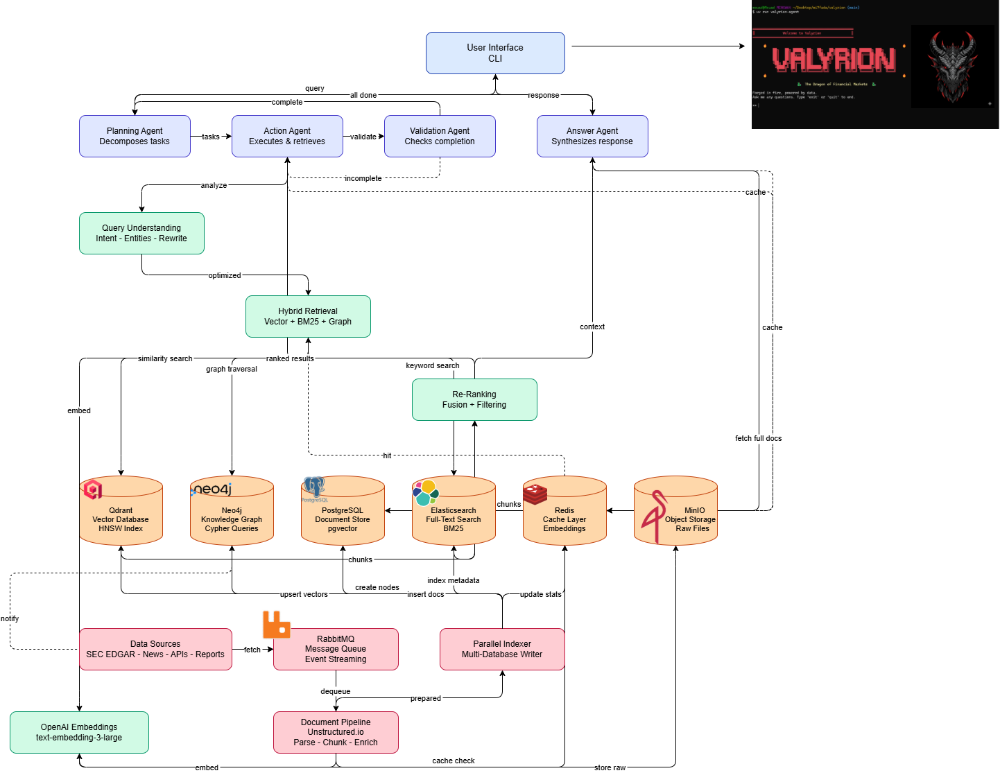

# Valyrion CLI - Dragon-Powered Financial Research with Massive RAG

A comprehensive Retrieval-Augmented Generation (RAG) system for financial research, deployed on AWS with Terraform.



## Overview

Valyrion RAG transforms the original tool-based financial research agent into an enterprise-grade system capable of:

- **Massive Knowledge Base**: Index and query millions of financial documents
- **Hybrid Retrieval**: Vector search + BM25 + Knowledge Graph traversal
- **Multi-Agent Orchestration**: Planning, Action, Validation, and Answer agents
- **Real-Time Updates**: Continuous ingestion from SEC EDGAR, news, and APIs
- **Enterprise Scale**: Deployed on AWS with auto-scaling and high availability

## Architecture

### 5-Layer System

1. **User Interface**: CLI, Web API, WebSocket streaming
2. **Orchestration**: Multi-agent system (Planning → Action → Validation → Answer)
3. **RAG Intelligence**: Query understanding, hybrid retrieval, re-ranking
4. **Knowledge Storage**: Qdrant, Neo4j, PostgreSQL, Elasticsearch, Redis, S3
5. **Data Ingestion**: Multi-source collectors, document processing, parallel indexing

See [Architecture Documentation](./docs/architecture.md) for details.

## Quick Start

### Prerequisites

- AWS Account with configured credentials
- Terraform >= 1.5.0
- Python 3.10+
- Docker
- OpenAI API key
- Finnhub API key (free tier)

### Installation

1. **Clone repository**
   ```bash
   cd valyrion
   ```

2. **Install dependencies**
   ```bash
   # Using uv (recommended)
   uv sync

   # Or using pip
   pip install -r requirements.txt
   pip install -e .
   ```

3. **Configure environment**
   ```bash
   cp env.example .env
   # Edit .env with your API keys and configuration
   ```

4. **Set up Terraform backend**
   ```bash
   # Create S3 bucket for Terraform state
   aws s3 mb s3://valyrion-terraform-state --region us-east-1

   # Create DynamoDB table for state locking
   aws dynamodb create-table \
     --table-name valyrion-terraform-locks \
     --attribute-definitions AttributeName=LockID,AttributeType=S \
     --key-schema AttributeName=LockID,KeyType=HASH \
     --billing-mode PAY_PER_REQUEST \
     --region us-east-1
   ```

5. **Deploy infrastructure** (DO NOT RUN YET - just example)
   ```bash
   cd terraform/environments/dev
   terraform init
   terraform plan
   # terraform apply  # Only when ready to deploy
   ```

## Project Structure

```
valyrion/
├── terraform/                  # Infrastructure as Code
│   ├── modules/
│   │   ├── networking/        # VPC, subnets, security groups
│   │   ├── databases/         # RDS, Redis, OpenSearch, S3
│   │   └── ecs-service/       # ECS task definitions
│   └── environments/
│       ├── dev/               # Development environment
│       └── prod/              # Production environment
│
├── src/valyrion/              # Application code
│   ├── rag/                   # RAG system
│   │   ├── ingestion/         # Document fetching, parsing, chunking
│   │   ├── retrieval/         # Vector, BM25, graph search
│   │   ├── storage/           # Database clients
│   │   ├── embeddings/        # OpenAI embeddings
│   │   └── query/             # Query understanding
│   ├── agents/                # Multi-agent system
│   ├── api/                   # FastAPI application
│   └── workers/               # Background workers
│
├── docker/                    # Dockerfiles
│   ├── Dockerfile.api         # API server
│   └── Dockerfile.worker      # Ingestion worker
│
├── scripts/                   # Utility scripts
│   ├── ingest_sec_filings.py  # SEC data ingestion
│   └── evaluate_retrieval.py  # RAG evaluation
│
├── tests/                     # Test suite
│   ├── unit/                  # Unit tests
│   ├── integration/           # Integration tests
│   └── e2e/                   # End-to-end tests
│
├── docs/                      # Documentation
│   ├── architecture.md        # System architecture
│   └── deployment.md          # Deployment guide
│
├── TASKS.md                   # Implementation tasks (100+ tasks)
├── TRANSITION_PROPOSITION.md  # Technical proposal
└── valyrion-architecture-clean.mmd  # Mermaid diagram
```

## Components

### Vector Database (Qdrant)
- 3072-dim embeddings (OpenAI text-embedding-3-large)
- HNSW index for fast similarity search
- Metadata filtering (company, date, document type)

### Knowledge Graph (Neo4j)
- Entities: Companies, Products, Executives, Events
- Relationships: COMPETES_WITH, SUPPLIES_TO, REPORTED_IN
- Cypher queries for multi-hop reasoning

### Document Store (PostgreSQL)
- Full documents with metadata
- Query logs and analytics
- pgvector extension for hybrid queries

### Full-Text Search (Elasticsearch)
- BM25 ranking
- Keyword search and boosting
- Metadata indexing

### Cache Layer (Redis)
- Embedding cache (TTL: 30 days)
- Query result cache (TTL: 1 hour)
- Session data

### Object Storage (S3)
- Raw documents (PDFs, HTMLs)
- Lifecycle policies (archive to Glacier after 90 days)
- Versioning enabled

## Development

### Run API Server Locally
```bash
uvicorn valyrion.api.main:app --reload
```

### Run CLI
```bash
valyrion-agent
```

### Ingest Sample Data
```bash
python scripts/ingest_sec_filings.py
```

### Run Tests
```bash
pytest tests/ -v
pytest tests/unit/ -v --cov=valyrion
```

## Deployment

### Build Docker Images
```bash
# API
docker build -t valyrion-api -f docker/Dockerfile.api .

# Worker
docker build -t valyrion-worker -f docker/Dockerfile.worker .
```

### Deploy to AWS (via Terraform)
```bash
cd terraform/environments/dev
terraform init
terraform plan -out=tfplan
# terraform apply tfplan  # Only when ready
```

## Configuration

### Environment Variables

Key variables in `.env`:
- `OPENAI_API_KEY`: OpenAI API key
- `FINNHUB_API_KEY`: Finnhub API key
- `POSTGRES_HOST`: PostgreSQL host
- `REDIS_HOST`: Redis host
- `QDRANT_HOST`: Qdrant host
- `NEO4J_URI`: Neo4j connection URI
- `OPENSEARCH_HOST`: OpenSearch/Elasticsearch host
- `S3_BUCKET_NAME`: S3 bucket for documents

### Terraform Variables

Key variables in `terraform/environments/dev/terraform.tfvars`:
- `environment`: Environment name (dev, prod)
- `vpc_cidr`: VPC CIDR block
- `api_instance_count`: Number of API servers
- `postgres_instance_class`: RDS instance type
- `enable_multi_az`: Enable Multi-AZ for databases

## API Usage

### Query Endpoint
```bash
curl -X POST http://localhost:8000/query \
  -H "Content-Type: application/json" \
  -d '{
    "query": "What was Apple'\''s revenue in Q4 2023?",
    "filters": {
      "company": "AAPL",
      "date_from": "2023-10-01",
      "date_to": "2023-12-31"
    }
  }'
```

### Response
```json
{
  "answer": "Apple's Q4 2023 revenue was $119.6B...",
  "sources": [
    {
      "document_id": "doc_123",
      "document_type": "10-K",
      "company": "AAPL",
      "date": "2023-11-02",
      "excerpt": "Revenue for Q4 2023...",
      "score": 0.95
    }
  ],
  "confidence": 0.92,
  "latency_ms": 1234
}
```

## Performance Targets

- **Query Latency**: <2s (P95)
- **Answer Correctness**: >85%
- **Retrieval Recall@10**: >90%
- **Cost per Query**: <$0.05
- **System Uptime**: 99.5%

## Cost Estimate

**Monthly Production Costs** (~1M documents, 10K queries/day):
- AWS Infrastructure: $600-800
  - ECS: ~$200
  - RDS PostgreSQL: ~$150
  - ElastiCache Redis: ~$100
  - OpenSearch: ~$150
  - EC2 (Qdrant, Neo4j): ~$150
  - S3 + misc: ~$50
- OpenAI API: $400-600
  - Embeddings: ~$100
  - LLM calls: ~$300-500

**Total**: ~$1,000-1,400/month

**Cost per query**: ~$0.04

## Implementation Plan

See [TASKS.md](./TASKS.md) for the complete implementation roadmap:
- **Phase 1**: Core Infrastructure (Weeks 1-2)
- **Phase 2**: RAG Pipeline (Weeks 3-4)
- **Phase 3**: Agent Integration (Weeks 5-6)
- **Phase 4**: Deployment (Weeks 7-8)
- **Phase 5**: Testing (Week 8)
- **Phase 6**: Scale & Production (Weeks 9-10)
- **Phase 7**: Documentation (Week 11)

**Total Duration**: 10-12 weeks

## Monitoring

- **CloudWatch Dashboards**: API metrics, database performance, costs
- **CloudWatch Alarms**: Latency, error rate, resource utilization
- **Prometheus Metrics**: Application-level metrics
- **AWS X-Ray**: Distributed tracing (optional)

## Security

- **Authentication**: API key-based
- **Encryption**: TLS 1.2+ in transit, AES-256 at rest
- **IAM**: Least-privilege roles
- **Secrets Management**: AWS Secrets Manager
- **WAF**: Rate limiting, attack protection
- **VPC**: Private subnets for databases

## Contributing

1. Create feature branch
2. Make changes
3. Run tests: `pytest tests/ -v`
4. Run linters: `black . && isort . && flake8`
5. Submit pull request

## License

[Your License Here]

## Support

For issues and questions:
- GitHub Issues: [Your Repo URL]
- Documentation: `docs/`
- Email: [Your Email]

## Acknowledgments

- OpenAI for GPT-4 and embeddings
- Qdrant for vector database
- Neo4j for knowledge graph
- LangChain for agent framework
- Unstructured.io for document parsing

---

**Built with 🐉 by MOUAD AYOUB**
